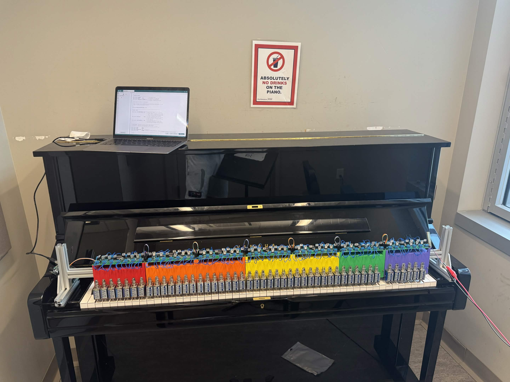
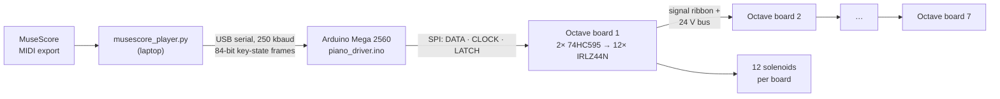
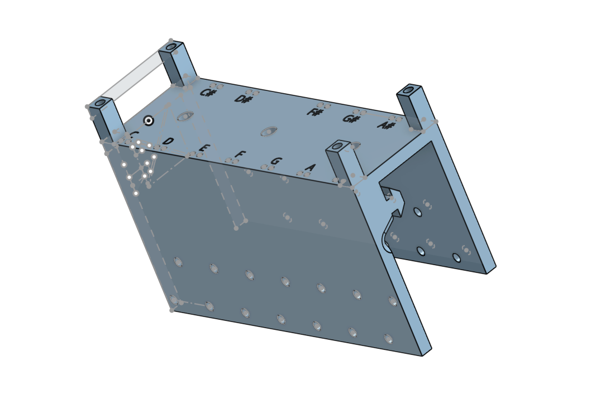

# Robotic Piano Actuator

**A modular, clamp-on solenoid system that plays an acoustic piano from a MIDI score. Scaled from a one-octave prototype to a 7-octave (84-key) array of daisy-chained driver boards.**

Northwestern University · Summer Undergraduate Research Grant (SURG) 2026
Jordan Boymel · Advisor: Dr. Brenna Argall, Assistive & Rehabilitation Robotics Lab, Shirley Ryan AbilityLab

<!-- MEDIA: put the best single photo here (the full array on the piano, or one octave board close-up).

-->

> **Status (Sept 2026): hardware, firmware, and host software complete; full-scale tuning paused.**
> The whole pipeline, from MIDI to solenoids, runs. The final demo used a lower-rated 24 V supply because the main supply couldn't be wired properly, and several actuators strike inconsistently. See [Current status and known issues](#current-status-and-known-issues).

---

## Why

Self-playing pianos are purpose-built, expensive instruments. This project asks whether a modular attachment can turn an ordinary piano into a music-making machine instead. It is motivated by making piano playing accessible to people with motor disabilities, and by the number of acoustic pianos that sit unused.

## What I built

| Area | What it is |
|---|---|
| **Driver electronics** | Custom 2-layer KiCad PCB, one per octave: 12 low-side MOSFET channels, flyback protection, and a shift-register serial interface. Boards daisy-chain for power and signal. |
| **Actuation** | 24 V push-pull solenoids (one per key) with a threaded felt-tipped striker |
| **Mechanical** | Parametric Onshape bracket that straddles 80/20 T-slot extrusion over the keybed. Key pitch was measured on a real piano. |
| **Firmware** | Arduino Mega sketch that receives full keyboard state over USB serial and clocks it to the shift-register chain, with safety interlocks |
| **Host software** | Python player that reads a MuseScore MIDI export, compensates for actuator latency, and streams frames to the Arduino |

## System architecture



The Arduino connects to the whole 84-key array through **five wires**: 5 V, GND, DATA (pin 51), CLOCK (pin 52), and LATCH (pin 8).

## Hardware

### Octave driver board
<!-- MEDIA: KiCad 3D render and/or photo of an assembled board

-->
- **163.8 × 52.4 mm**, 2-layer. Four M3 mounting holes on a 155.8 × 44.4 mm pattern.
- **Two 74HC595 shift registers** per board, in DIP sockets and cascaded (U1 QH′ → U2 SER). 12 of 16 outputs are used. SRCLR is tied high and OE is tied low.
- **12 × IRLZ44N** logic-level MOSFETs (55 V V<sub>DS</sub>), low-side switching, TO-220 mounted vertically to save board depth.
- **FR307 flyback diode** across each solenoid, and an SMBJ28A TVS diode for transient protection.
- Each MOSFET gate has a 220 Ω and a 10 kΩ resistor.
- GND pour on B.Cu and +24 V on F.Cu. Trace widths sized to IPC-2152 for solenoid current.
- **Power in/out:** screw terminals J15 → J16 pass the 24 V bus board-to-board on heavy wire. Logic signals chain separately on a 5-conductor ribbon.
- First spin fabricated by JLCPCB. Seven boards assembled.

### Actuators and strikers
- **JF-1039B** push-pull solenoid: 25 N, 10 mm stroke, about 400 mA at 24 V.
- **Striker:** an M4 × 0.7 coupling nut threads onto the plunger, with a 3/8″ felt pad on the contact face to protect the keys and soften the attack.

### Mounting bracket
<!-- MEDIA: Onshape screenshot of the bracket, and a photo of it on the extrusion

-->
- An asymmetric inverted-U saddle that straddles 80/20 T-slot extrusion. It is fully parametric in Onshape.
- Key pitch was measured on a real piano and adjusted from 23.4 mm to about 23.5 mm. The standoff inset is a parameter, so the bracket stays compatible with the PCB hole pattern.

### Power
- **24 V solenoid bus:** a single 1500 W (62.5 A) switching supply, chained board-to-board.
- **5 V logic:** supplied from the laptop over the Arduino's USB connection and carried to every board on the signal ribbon.
- All grounds are common.

## Firmware and control

### Serial protocol (host → Arduino)

| Field | Bytes | Value |
|---|---|---|
| Sync | 2 | `0xAA 0x55` |
| Key state | 11 | 84 bits, one per key (1 = energized) |
| Checksum | 1 | XOR |

Sent at 250000 baud. Every frame carries the full keyboard state. The Arduino never has to reconstruct note-on/note-off history, so a dropped frame is simply replaced by the next one.

### Safety limits (firmware)

| Limit | Value | Purpose |
|---|---|---|
| `MAX_SIMULTANEOUS` | 20 keys | Caps solenoid current at about 8 A |
| `MAX_ON_MS` | 5000 ms | Releases any key held too long, which protects the coils from overheating |
| `LINK_TIMEOUT_MS` | 500 ms | Releases all keys if the host stops sending valid frames |

### Latency compensation (host)
Measured strike latency is about 50 ms from energize to key contact. `musescore_player.py` schedules every note `ATTACK_LATENCY_MS` (≈50 ms) early so strikes land on the beat. It also enforces `MINIMUM_STRIKE_HOLD_MS` (≈10 ms) so very short notes still fully depress the key.

The latency also sets a mechanical limit: repeated notes on the same key top out around sixteenth notes at 95–100 BPM.

## Design evolution

The project started as a one-octave bench prototype focused on characterizing a single key. The table lists the major changes on the way to 84 keys.

| Change | Why |
|---|---|
| One Arduino pin per key → **74HC595 shift-register chain** | 84 keys can't each get a pin. Three signal lines now drive any number of boards. |
| IRLB8721 (30 V) → **IRLZ44N (55 V)** | More drain-voltage margin against inductive switching transients on a 24 V rail |
| 3-tier PCB stack → **2 tiers** | The FSR circuit was confirmed as instrumentation only, not part of the production drive path |
| One large board → **one PCB per octave, daisy-chained** | Identical boards are cheaper to fabricate, easier to debug, and scale to any number of octaves |
| Key pitch 23.4 mm → **≈23.5 mm** | Measured on a real piano. The error accumulates across an octave. |

Peer review of the schematics caught wiring errors before fabrication, including flyback diode polarity and MOSFET pinout.

## Current status and known issues

**Works**
- Seven octave boards assembled and running on one chain.
- Firmware, serial protocol, and safety limits are working.
- The Python player drives the array from MuseScore MIDI.
- The shift-register chain was validated with indicator LEDs before solenoids were connected.

**Resolved**
- **Chain failure when scaling from 3 to 7 boards.** The symptoms looked like a power-budget problem, but the cause was one shift register seated backwards in its socket. Write-up: [docs/power-debugging.md](docs/power-debugging.md).

**Known issues**
1. **Demo run on an underpowered 24 V supply.** The main 1500 W supply couldn't be wired in time for the final demo because the right-gauge wire was missing, so a lower-rated supply stood in.
2. **Inconsistent strikes on some actuators.** Not yet diagnosed. An under-supplied 24 V rail (issue 1) is the first suspect. Solenoid, striker, or mounting variation still has to be ruled out once the main supply is connected.

<!-- MEDIA: even an imperfect clip is worth including. Label it honestly, e.g.
**Demo (Sept 2026, reduced-power supply):** [video](media/demo.mp4)
-->

## Next steps
- Wire in the main 24 V supply and re-test all 84 channels.
- Diagnose the inconsistent actuators channel by channel (current draw, stroke, striker seating).
- Quantify timing and force consistency. The original proposal set targets (mean onset error under 10 ms, standard deviation under 5 ms, force coefficient of variation under 15%) and planned an FSR 402 and TCST2103 photointerrupter rig to measure them. That rig was prototyped on the bench but not used in the final build, and no characterization data has been collected yet.
- Record a clean full-keyboard demo.

## Lessons learned
- **Check the assembly before redesigning the system.** The failure at 7 boards looked like a supply problem, and I had started planning a separate 5 V supply. The actual cause was one reversed IC.
- **Scale in steps and test at each one.** Adding boards incrementally narrowed the fault to the new part of the chain.
- **Design reviews pay for themselves.** Wiring errors were caught on paper instead of on a powered board.

## Repository layout

```
firmware/
  piano_driver/        Arduino Mega sketch (serial → shift-register chain)
  bench_test/          Serial logger from the single-key bench prototype
host/                  musescore_player.py (MIDI → serial frames)
hardware/
  octave-board/        KiCad project, schematic PDF, Gerbers
cad/                   Bracket (Onshape link + exported STL/STEP)
matlab/analysis/       Trial analysis (onset time and force statistics)
data/processed/        Characterization data
docs/                  BOM, wiring, power debugging write-up
media/                 Photos and video
```

> `matlab/analysis/analyze_trials.m` generates **placeholder data** if no real trial CSV is present. Any plots it produces without real data are not results.

## Bill of materials and wiring
- [Bill of materials](docs/bom.md)
- [Prototype bench wiring](docs/wiring.md)
- [Debugging the 7-board chain failure](docs/power-debugging.md)
